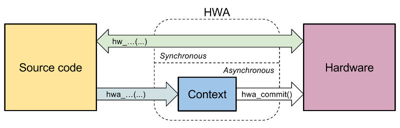

HWA
===

`HWA`(*) is a hardware abstraction tool for programming
microcontrollers in C language. A few features of HWA are useful for programming
in assembler too.

HWA provides a set of object-oriented generic instructions that allow the
programmer to focus on the result rather than the values that must be written
into registers with the hope that it will lead to source codes easier to read,
easier to maintain, and easier to port between different targets.

HWA is not a library. It is implemented at the preprocessing and compilation
levels and a cache mechanism combined to the compiler's optimizers help HWA
produce machine code free of any penalty, either in terms of size, execution
speed or memory used.

Examples
--------

The `examples/` directory contains a few examples aimed at illustrating various
features of HWA, currently only for Atmel ATtiny44 and ATtiny84 devices
(ATtinyx5 and ATmegax8 should be available soon as they were already supported
before HWA was last rewritten).

As a first check, you can run `make tests` in the HWA base directory to check
that all examples compile without error. You'll need a properly configured
avr-gcc toolchain for that (avr-libc is not required). You can also run `make
checks` to verify that the generated code is the same that I obtained.

The `main.c` file of each example gives informations about what it does and how
you can test it. A Python application is provided with the examples that can
communicate with the host.

Files stored in the `examples/targets/` directory contain definitions for the
targets I use: configuration of the microcontroller (fuses...), configuration of
the Diabolo bootloader, LED pins used on Arduino boards...

If you want to run one of these examples on a microcontroller in which you
previously installed Diabolo (see below), you just have to connect your USB-UART
adapter and run `make install`.

If you prefer to use another programming method, you'll find the machine code to
be programmed in the `build/out.bin` file. In the Makefile, you can define
`PROG_SW` and `PROG_HW` with the names of your programming tools to override the
default Diabolo. For example:

    PROG_SW = avrdude
    PROG_HW = usbasp

You'll have to provide a specific makefile if you use neither Diabolo nor
avrdude. Look at the `examples/make/` directory.

Documentation
-------------

Run `make doc` in the HWA base directory to build the documentation in HTML
format. You'll start with the [doxygen/html/index.html](doxygen/html/index.html)
page.

Diabolo
-------

Diabolo is a bootloader (Diabolo Is A BOot LOader) that I developped using HWA
for assembler programming. It is fast, as the host side uses a cache mecanism to
determine pages that have to be programmed. It is not too big: ~640 bytes. It is
very convenient since it can use 1 or 2-wire serial lines with auto-detection
and auto-synchronization so that the baudrate does not have to be hardcoded in
the project and no crystal is required for the device.

The source code of the device-side of Diabolo is under
`examples/diabolo/device/diabolo.sx`.

The host-side Diabolo application is under `examples/diabolo/host/diabolo.py`.

Swuarta
-------

Swuarta is a software UART for Atmel AVR devices. It is used in the examples so
that the same code can be written, the device having an UART or not. This is
also an example of hardware virtualization that you can do with HWA. Swuarta is
programmed in assembler and you'll find the source code under
`hwa/atmel/avr/swuarta/`.

In the examples, the swuart uses the same I/O pins as Diabolo so that you will
not have to touch any wire between programming and executing the example.

Status
------

WARNING: this project is subject to heavy changes of the code-base, including
project-wide name changes.

Because I do this as a hobby in my spare time, sometimes not touching it for
several weeks, the development pace of HWA is as much irregular as the road I
follow. Besides, I have many things to learn about Doxygen, git or just about
project management.

So, though I started to write it in 2010, HWA is still not stabilized. It was
first designed to be used with STM32 devices, but making it also work with Atmel
AVRs took me a lot of time because of the arrangement of the registers in these
devices. That led me to rewrite HWA several times, as I discovered mistakes in
the conception, new possibilities with the preprocessor or simply that I could
make things better (e.g. object-oriented instructions accepting variable-length
lists of arguments).

License
-------

HWA is free software. See the @ref license page for license information.

(*): <i>"Wah! a statement or exclamation, in several languages that
shows pleasure, appreciation and surprise."</i> -- Wikipedia.
